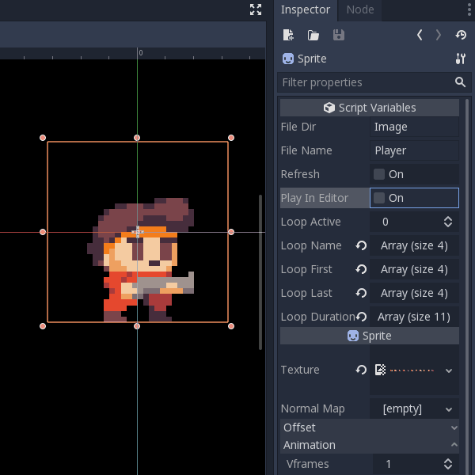

# AsepriteGodot
An animation solution for Godot Engine and Aseprite

Created by Harmony Honey | [hhoney.net](http://hhoney.net/)

Last tested with Godot v3.1.2 and Aseprite v1.2.16.3

## Purpose
Play Animation Loops defined in Aseprite.

Import data from .json file created by Aseprite.

Assign a texture to the Sprite Node.

## Importing
This script reads JSON Data created by Aseprite.

Using "Export Sprite Sheet" (Ctrl+E in Aseprite),

Export "Output File" (as .png) and "JSON Data" (as Hash structure)

Export the Sprite Sheet as a "Horizontal Strip"

Keep the .png and .json within the same folder in your Godot Project

## Using the Script
Interact with the script at runtime by calling:

set_loop(), get_loop() and try_loop()

Feel free to contact me with questions and comments!

## License
This repository is free software! See [license](license) for details.
